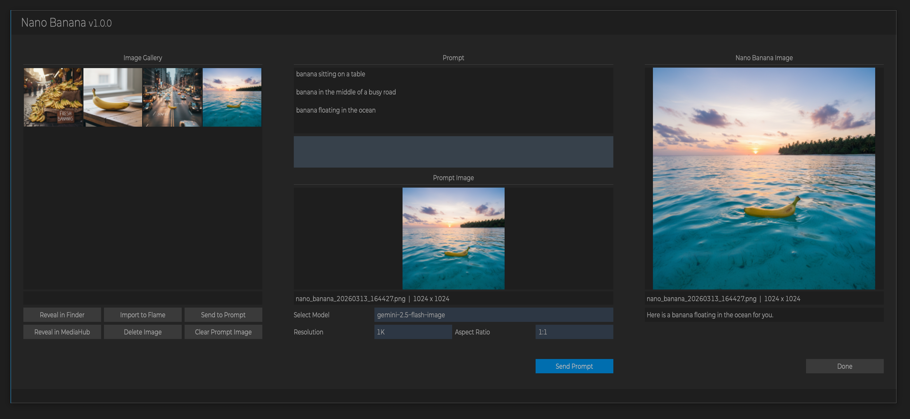

# Nano Banana

**Script Version:** v1.0.1 
**Flame Version:** 2025.2 
**Written by:** Michael Vaglienty 

**Script Type:** Media Panel

## License

GNU General Public License v3.0 (GPL-3.0) - see LICENSE file for details

## Description

Nano Banana integration for Flame.
  
Nano Banana/Gemini API key is required to use this script.
  

## Workflow

Run the script with a clip selected in the media panel to export the first frame of the clip
to the script's images folder and add it to the prompt.
  
If no clip is selected, the script will start with a blank prompt.
  
After getting back an image from Nano Banana the image is automatically added to the prompt.
  
When done prompting use the Import to Flame button to import the desired image to the media panel.
  
Buttons:
  
Send Prompt: Sends the current prompt to Nano Banana at the selected model and resolution.
  
Import to Flame: Import the current selected image in the Image Gallery to the media panel.
  
Send to Prompt: Adds the selected image in the Image Gallery to the prompt.
  
Clear Prompt Image: Clears the current prompt image from the prompt.

## Menus

### Script Setup
- Flame Main Menu → Logik Portal → Logik Portal Script Setup → Nano Banana Setup
### To prompt Nano Banana with no prompt image
- Media Panel → Right-click → Nano Banana
### To prompt Nano Banana with a prompt image
- Media Panel → Right-click on clip or sequence → Nano Banana

## Installation

Copy script into /opt/Autodesk/shared/python/nano_banana

## Updates

### v1.0.0 [03.13.26]
- Initial release.
